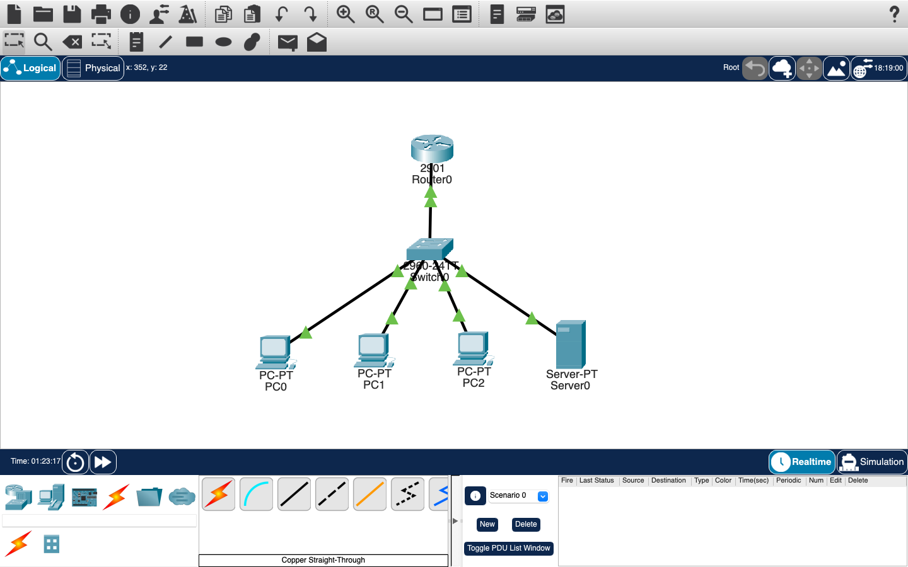
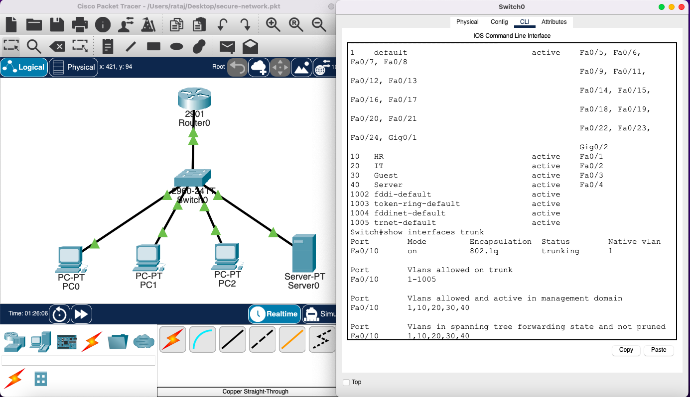
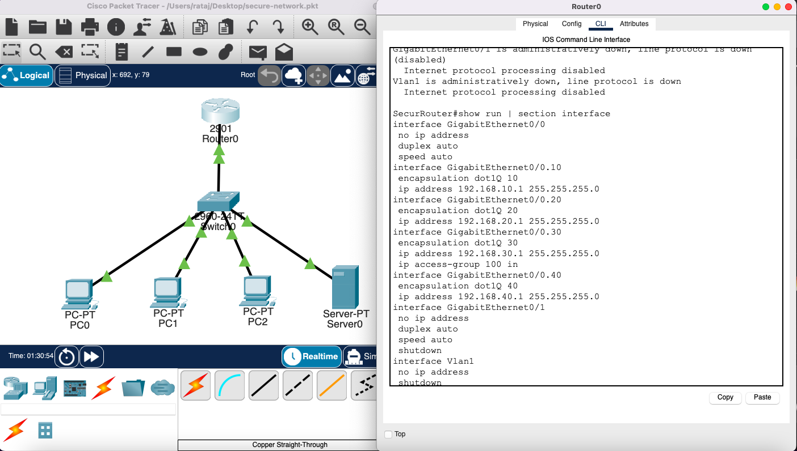
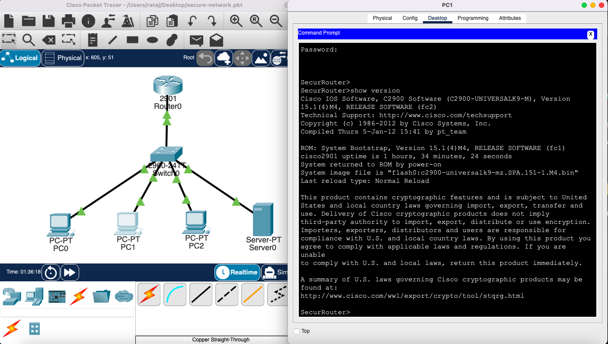
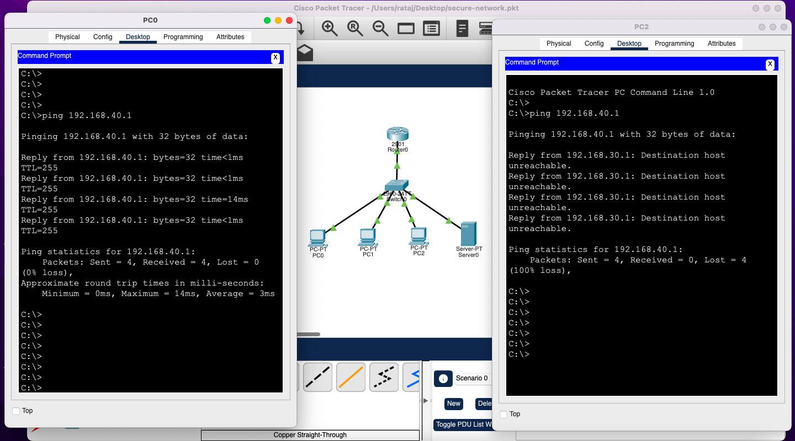

<!DOCTYPE html>
<html>
<head>
    <meta charset="UTF-8">
</head>

<body>

<h1>Secure Enterprise Network Design</h1>

This project was implemented using Cisco Packet Tracer to design a secure enterprise network applying cybersecurity principles.

<h2>Project Overview</h2>

The goal of this project is to design a secure network using VLANs, ACLs, DHCP, SSH, and Port Security.

<h2>Network Topology</h2>

Shows the full network including router, switch, PCs, and server.

<h2>VLAN Configuration</h2>

Network is divided into HR, IT, Guest, and Server VLANs.

<h2>ACL Configuration</h2>

Guest network is blocked from accessing the server network.

<h2>SSH Configuration</h2>

Secure remote access using SSH instead of Telnet.

<h2>Ping Test Results</h2>

HR can access server, Guest is blocked.

<h2>Security Principles Used</h2>
<ul>
    <li>Least Privilege</li>
    <li>Network Segmentation</li>
    <li>Access Control</li>
    <li>Defense in Depth</li>
    <li>Secure Communication</li>
</ul>

<h2>Tools Used</h2>

Cisco Packet Tracer

<h2>Conclusion</h2>

This project demonstrates a secure enterprise network design using VLANs, ACLs, SSH, DHCP, and Port Security.

</body>
</html>
